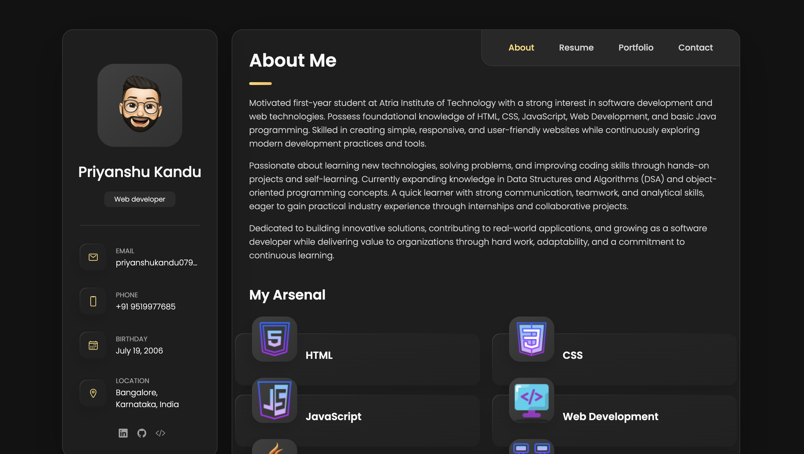
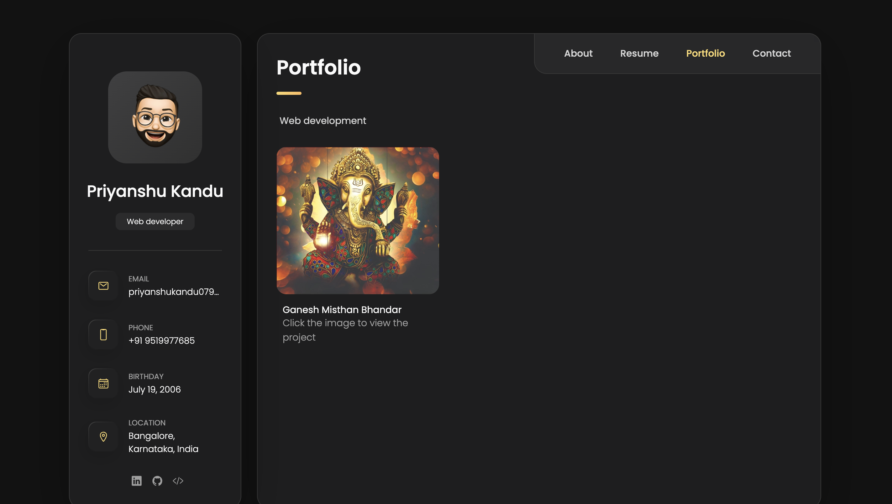
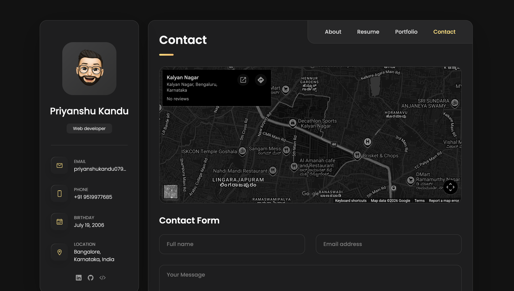

# 🌐 Personal Portfolio Website

Welcome to my Personal Portfolio Website! This project showcases my skills, projects, education, and journey as a Web Developer.

## 🚀 Live Demo

🔗 **Visit Portfolio:**  
https://priyanshu0719.github.io/personal-portfolio/

---

## 📸 Website Preview

### 🏠 Home Page / 👨‍💻 About Section

### 🛠️ Skills Section

### 📂 Projects Section

### 📞 Contact Section

---

## 📖 About

This portfolio was developed to create a professional online presence and showcase my work, skills, and achievements. It reflects my passion for web development and continuous learning in technology.

## ✨ Features

- Responsive Design
- Modern User Interface
- Professional Profile Section
- Skills Showcase
- Projects Section
- Contact Information
- Social Media Integration
- Mobile-Friendly Layout

---

## 🛠️ Technologies Used

| Technology | Purpose |
|------------|---------|
| HTML5 | Structure |
| CSS3 | Styling |
| JavaScript | Interactivity |
| Git | Version Control |
| GitHub Pages | Deployment |

---

## 📂 Sections Included

- 🏠 Home
- 👨‍💻 About Me
- 🛠️ Skills
- 📂 Projects
- 📞 Contact

---

## 🎯 Objectives

- Showcase my technical skills
- Highlight my projects and achievements
- Build a professional portfolio
- Improve frontend development skills

---

## 🤝 Internship Project

This portfolio website was developed as part of my internship at **InAmigos Foundation (IAF)**. The internship provided me with valuable hands-on experience in web development and helped me strengthen my frontend development skills.

---

## 📬 Connect With Me

### LinkedIn
🔗 https://www.linkedin.com/in/priyanshu-kandu/

### Portfolio
🔗 https://priyanshu0719.github.io/personal-portfolio/

---

## ⭐ Support

If you like this project, consider giving it a ⭐ on GitHub.

---

  Made with ❤️ by <strong>Priyanshu Kandu</strong>

